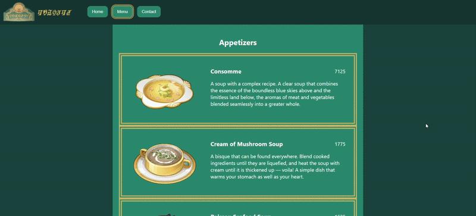

# restaurant-page

The restaurant page project involves the creation of a restaurant homepage through dynamically rendering the contents of the homepage.

The main learning objectives of the project were to become familiar with bundling modules through setting up and configuring Webpack and exporting and importing from other modules to the entry point of the application to understand the concept of modularity with the implementation of tabbed browsing.

Other learning outcomes were the design of the carousel to showcase images of the restaurant interior, the use of transitions and transformations for the promotion of the performance hosted at the restaurant venue, and advanced styling features released in the latest browser versions for more control over styling forms.

## Disclaimer

### miHoYo/HoYoverse

> miHoYo does not prohibit non-commercial personal use. Addtionally, you understand and agree that the rights to all Genshin Impact MATERIALS (such as copyright, trademark, and other intellectual property rights) have not been transferred to you from miHoYo and its related obligees, nor should it be regarded as an approval in the legal sense (including implied approval). miHoYo reserves the right to exercise its rights (including but not limited to the derivative works produced and released based on Genshin Impact MATERIALS). At the same time, it is required to place the miHoYo legal declaration on such works, such as "© All rights reserved by miHoYo. Other properties belong to their respective owners."

**© All rights reserved by miHoYo. Other properties belong to their respective owners.**

### Genshin Impact Wiki

> Unless specifically noted otherwise, all of the text on a wiki is licensed under the Creative Commons Attribution-Share Alike License 3.0 (Unported) (CC-BY-SA).
> 
> ...
>
> The CC-BY-SA has some very clear terms or requirements that have to be followed to qualify for the license. To adhere to the terms of the CC-BY-SA, anyone who reuses the content has to do these things:
> 1. Identify the license used and link to the license terms (for example, https://www.fandom.com/licensing or https://creativecommons.org/licenses/by-sa/3.0/ ).
> 2. Attribution (BY), means that whoever uses the content has to make sure that the original author receives credit. When you add your content to Fandom, you agree that being attributed in any of the following ways satisfies the attribution requirement:
> - A link to or URL of the original article.
> - A link to or URL of a stable copy of the article that credits the authors similarly to the edit history on Fandom.
> - A list of all the contributing authors.
> 3. Sharealike (SA) means that if you alter, transform, or build upon the material, you can only release the resulting work under the same or similar license. Because of this, if you add more information, then that information along with the original content must remain under the same license, or one very close to it. You also need to identify the changes to the original work. On Fandom wikis, this is done automatically through versioning and diff views.

**This work is licensed under the Creative Commons Attribution-ShareAlike 3.0 (Unported) (CC-BY-SA). To view a copy of the license, click https://creativecommons.org/licenses/by-sa/3.0/.**

- Boudin Nour aux Pommes - https://genshin-impact.fandom.com/wiki/Boudin_Noir_aux_Pommes
- Bulle Sauce Duck Breast - https://genshin-impact.fandom.com/wiki/Bulle_Sauce_Duck_Breast
- Cassoulet - https://genshin-impact.fandom.com/wiki/Cassoulet
- Consomme - https://genshin-impact.fandom.com/wiki/Consomm%C3%A9
- Cream of Mushroom Soup - https://genshin-impact.fandom.com/wiki/Cream_of_Mushroom_Soup
- Duck Confit - https://genshin-impact.fandom.com/wiki/Duck_Confit
- Fonta - https://genshin-impact.fandom.com/wiki/Fonta
- Fontaine Aspic - https://genshin-impact.fandom.com/wiki/Fontaine_Aspic
- Fontainian Foie Gras - https://genshin-impact.fandom.com/wiki/Fontainian_Foie_Gras
- Fricassee de Poulet - https://genshin-impact.fandom.com/wiki/Fricassee_de_Poulet
- Garlic Baguette - https://genshin-impact.fandom.com/wiki/Garlic_Baguette
- Ile Flottante - https://genshin-impact.fandom.com/wiki/Ile_flottante
- Lasagna - https://genshin-impact.fandom.com/wiki/Recipe:_Lasagna
- Poisson Seafood Soup - https://genshin-impact.fandom.com/wiki/Poisson_Seafood_Soup
- Rainbow Macarons - https://genshin-impact.fandom.com/wiki/Rainbow_Macarons
- Tomates Narbonnaises - https://genshin-impact.fandom.com/wiki/Tomates_Narbonnaises
- Tripes du Port - https://genshin-impact.fandom.com/wiki/Tripes_du_Port

### u/To_Bun

The creater wants to provide proper attribution to Reddit user [u/To_Bun](https://www.reddit.com/user/To_Bun/) for their creation of the font style for the Fontaine script. The creator encourages those who are interested to check out the [original Reddit post](https://www.reddit.com/r/Genshin_Impact/comments/1739kqe/fontaine_script_font/) and show some support to the original creator. 

## Installation

Clone the repository:
```bash
git clone https://github.com/your-username/restaurant-page.git
```

Change into the project directory:
```bash
cd calculator
```

Install packages with npm:
```bash
npm install
```

### Production

Build the project:
```bash
npm run build
```

Deploy production build:
```bash
npm run deploy
```

### Development

Start development server:
```bash
npm start
```

## Tabbed Browsing


## Homepage


## Menu


## Contact Form
